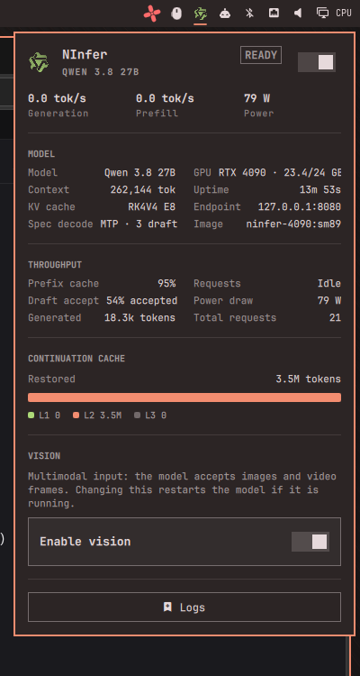

# omarchy-ninfer — NInfer Qwen status widget

A status-bar widget and drop-down panel for Omarchy that monitors and controls a
**local [ninfer](https://github.com/) Qwen 3.8 27B inference server running in
Docker** (RTX 4090 in the reference setup).



## What it does

- **Bar button** — the official Qwen mark, tinted by service state
  (green ready, accent starting, red failed, dimmed off)
- **Drop-down panel**
  - a single power switch (the only on/off control) that shows
    starting/stopping transitions while the model loads or stops
  - live at-a-glance strip: generation / prefill tok/s, power draw
  - model facts: context window, KV dtype, spec decode, endpoint, image
  - throughput: prefix-cache hit rate, draft acceptance, request counters
  - continuation cache: restored tokens with an L1/L2/L3 breakdown
  - a **vision input toggle** (opt-in; the model accepts images/video) —
    changing it restarts the model when it is running
  - a **logs** button that follows the container log in a terminal
- **Keyboard driven** — up/down moves through the power switch, the vision
  toggle, and the logs button; enter activates

## How it works

A bundled bash helper (`ninfer-qwen`) is the data plane. The panel polls it:

- `status` every 5 s (container lifecycle → `off` / `starting` / `ready` / `failed`)
- `info` every 4 s while the panel is open:
  - `/v1/models` (OpenAI-compatible) for model facts and the vision modality
  - `/metrics` (Prometheus) for throughput, prefix/draft/continuation counters
  - `nvidia-smi` for GPU name, VRAM, and power draw

The helper manages the Docker container (`start` / `rm` + re-`run`, since
launch args are baked in) and persists the vision preference to
`~/.config/ninfer-qwen/vision`.

## Install

```sh
omarchy plugin add https://github.com/keylimesoda/omarchy-ninfer.git --enable
```

The widget lands in the right bar section (its manifest default). Update with
`omarchy plugin update keylimesoda.ninfer`, remove with `omarchy plugin remove`.

## Requirements

- Omarchy (this is a shell plugin; first-party plugins are not required)
- Docker with NVIDIA GPU support, `nvidia-smi` on the host
- The `ninfer-4090:sm89` image (or an equivalent image serving `ninfer-serve`)
- The model file at `/opt/ninfer/models/qwen3_8_27b.ninfer` inside the image
- `curl` and `python3` on the host (used by the helper)

## Adapting it to your setup

This is a reference implementation tailored to the ninfer + Qwen 3.8 27B +
RTX 4090 stack. The knobs live in the block at the top of the bundled
`ninfer-qwen` helper:

| Variable | Meaning |
|---|---|
| `container` | Docker container name the helper manages |
| `api` | Base URL of the OpenAI-compatible endpoint (`/v1/models`, `/metrics`) |
| `model_*_fallback` | Model facts used when the API is unreachable |
| `kv_dtype` / `spec` / `draft_tokens` | Static labels shown in the panel |
| `image` | Image name shown in the panel |

If your server's `docker run` line differs, adjust the `start_model` block in
the helper; the panel's telemetry assumes the `ninfer`/llama.cpp Prometheus
counter layout (`llamacpp_*`, `ninfer_*`).

Vision is off by default. Flip the toggle in the panel (or run
`ninfer-qwen vision on`) — the container is recreated with `--vision` so the
server reports `modalities.vision` accordingly.

## License

MIT — see [LICENSE](LICENSE). The Qwen mark is derived from the official Qwen
brand artwork, monochromized for use as a status icon.
