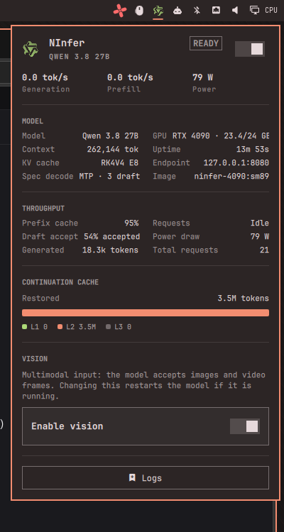

# omarchy-ninfer — NInfer Qwen status widget

A status-bar widget and drop-down panel for Omarchy that monitors and controls a
**local [NInfer-4090](https://github.com/tensorninja/ninfer-4090) Qwen 3.8 27B
inference server running in Docker** (RTX 4090 in the reference setup).



## What it does

- **Bar button** — the official Qwen mark, tinted by service state
  (green ready, accent starting, red failed, dimmed off)
- **Drop-down panel**
  - a single power switch (the only on/off control) that shows
    starting/stopping transitions while the model loads or stops
  - live at-a-glance strip: generation / prefill tok/s, power draw
  - model facts: context window, KV dtype, spec decode, endpoint, image
  - throughput: prefix-cache hit rate, draft acceptance, request counters
  - continuation cache: restored tokens with an L1/L2/L3 breakdown
  - a **vision input toggle** (opt-in; the model accepts images/video) —
    changing it restarts the model when it is running
  - a **logs** button that follows the container log in a terminal
- **Keyboard driven** — up/down moves through the power switch, the vision
  toggle, and the logs button; enter activates

## How it works

A bundled bash helper (`ninfer-qwen`) is the data plane. The panel polls it:

- `status` every 5 s (container lifecycle → `off` / `starting` / `ready` / `failed`)
- `info` every 4 s while the panel is open:
  - `/v1/models` (OpenAI-compatible) for model facts and the vision modality
  - `/metrics` (Prometheus) for throughput, prefix/draft/continuation counters
  - `nvidia-smi` for GPU name, VRAM, and power draw

The panel's data contract is the HTTP API that
[tensorninja's NInfer-4090 build](https://github.com/tensorninja/ninfer-4090)
exposes: the OpenAI-compatible `/v1/models` (with the `modalities` field), and
a llama.cpp-compatible `/metrics` plus the `ninfer_*` prefix/draft/continuation
counters specific to that runtime. Other ninfer builds or forks may not emit
those counters, in which case the affected panel sections will read zero or
hide.

The helper manages the Docker container (`start` / `rm` + re-`run`, since
launch args are baked in) and persists the vision preference to
`~/.config/ninfer-qwen/vision`.

## Install

```sh
omarchy plugin add https://github.com/keylimesoda/omarchy-ninfer.git --enable
```

The widget lands in the right bar section (its manifest default). Update with
`omarchy plugin update keylimesoda.ninfer`, remove with `omarchy plugin remove`.

### Engine

The helper drives one of two engines, both serving the API on `127.0.0.1:8080`:

- **lovelace** (default) — [keylimesoda/lovelace](https://github.com/keylimesoda/lovelace)
  via `$LOVELACE_DIR/deploy/serve.sh` (`LOVELACE_DIR` defaults to
  `~/Work/lovelace`; containers `lovelace` + `lovelace-proxy`). The power
  switch runs `serve.sh balanced` (or `serve.sh vision` with the vision
  toggle on) and `serve.sh stop`; the DFlash2 switch is hidden.
- **ninfer** — the `ninfer-qwen` container launched by the helper itself.

Pick one with `ninfer-qwen engine lovelace|ninfer` (stored in
`~/.config/ninfer-qwen/engine`; `NINFER_QWEN_ENGINE` overrides it). The helper
refuses to start an engine while the other one's container is running.
`ninfer-qwen restart` recreates the selected engine; `ninfer-qwen logs`
follows its log.

## Requirements

- Omarchy (this is a shell plugin; first-party plugins are not required)
- Docker with NVIDIA GPU support, `nvidia-smi` on the host
- lovelace: a lovelace checkout with the `lovelace-serve:latest` image built
  (see its `deploy/`)
- ninfer: the `ninfer-4090:hybrid` image and the model artifact the helper
  bind-mounts (`NINFER_MODEL_ARTIFACT`)
- `curl` and `python3` on the host (used by the helper)

## Adapting it to your setup

This is a reference implementation tailored to the NInfer-4090 + Qwen 3.8 27B +
RTX 4090 stack. The knobs live in the block at the top of the bundled
`ninfer-qwen` helper:

| Variable | Meaning |
|---|---|
| `engine` / `container` | Engine selection and the Docker container it manages |
| `api` | Base URL of the OpenAI-compatible endpoint (`/v1/models`, `/metrics`) |
| `model_*_fallback` | Model facts used when the API is unreachable |
| `kv_dtype` / `spec` / `draft_tokens` | Static ninfer labels (lovelace reads them from the container's args) |
| `image` | ninfer image name shown in the panel |

If your server's `docker run` line differs, adjust the `start_model` block in
the helper; the panel's telemetry assumes the
[tensorninja/ninfer-4090](https://github.com/tensorninja/ninfer-4090)
Prometheus counter layout (`llamacpp_*` token counters plus that runtime's
`ninfer_*` prefix/draft/continuation counters). If you run a different fork or
upstream ninfer, expect the continuation-cache and draft-acceptance sections to
be absent or zero until the counter names are adapted.

Vision is off by default. Flip the toggle in the panel (or run
`ninfer-qwen vision on`) — the container is recreated with `--vision` so the
server reports `modalities.vision` accordingly.

## License

MIT — see [LICENSE](LICENSE). The Qwen mark is derived from the official Qwen
brand artwork, monochromized for use as a status icon.
